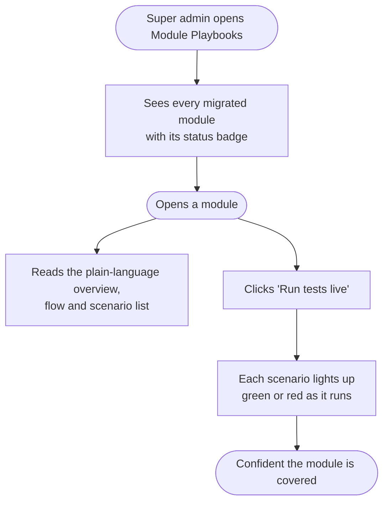

# Module Playbooks

The **meta module** that powers this very viewer. It is the thing that makes the
rebuild's promise real: every migrated module ships a `PLAYBOOK.md`, and this
module surfaces them — with **live scenario counts and test status** — to the
super admin at `/admin/playbooks`.

This module is Nexora-native (there was no equivalent in the legacy monolith); it
is one of the two genuinely new things in the rebuild (the other being the
**test suites** it reports on).

## What it does

For every module directory that contains a `PLAYBOOK.md`, it:

1. **Reads the markdown** at runtime (frontmatter via `gray-matter` + the body),
   so the source of truth stays in each module's folder.
2. **Parses the module's `features/*.feature` files** to list the Gherkin
   scenario titles + `@tags` and their counts.
3. **Merges live test status** from a `ci-status.json` the CI workflow publishes
   per module (pass/fail/coverage). When it's absent the status is `unknown` but
   the scenarios still render.
4. **Runs the tests live on demand** — an SSE endpoint streams jest results
   (unit then e2e, scoped to the module) so the viewer can light each scenario
   chip green/red in real time. Disabled when `NODE_ENV=production`.

## Endpoints

- `GET /admin/playbooks` — list every module with a playbook + its status
  (super admin only: `JwtAuthGuard` + `PlatformAdminGuard`).
- `GET /admin/playbooks/:module` — one module's rendered playbook + scenarios +
  CI status.
- `GET /admin/playbooks/:module/run` — Server-Sent-Events stream of a live test
  run for that module (dev/non-prod only). The frontend reads it with
  `fetch` + `ReadableStream` (not `EventSource`, so the Bearer token can be sent).

## Migration status

Nexora-native — nothing to migrate. Reads playbook files from
`src/modules/<name>/PLAYBOOK.md` (falls back to `dist/modules/...` in a built
image). CI status is read from `ci-status.json` at the process CWD, written by the
`publish-status` CI job.

## Rollback

Purely additive and read-only over the filesystem — it changes no product data.
To disable, stop mounting the `admin-playbooks` controller; the `PLAYBOOK.md`
files remain as plain documentation in each module.

## Flow (happy path)

