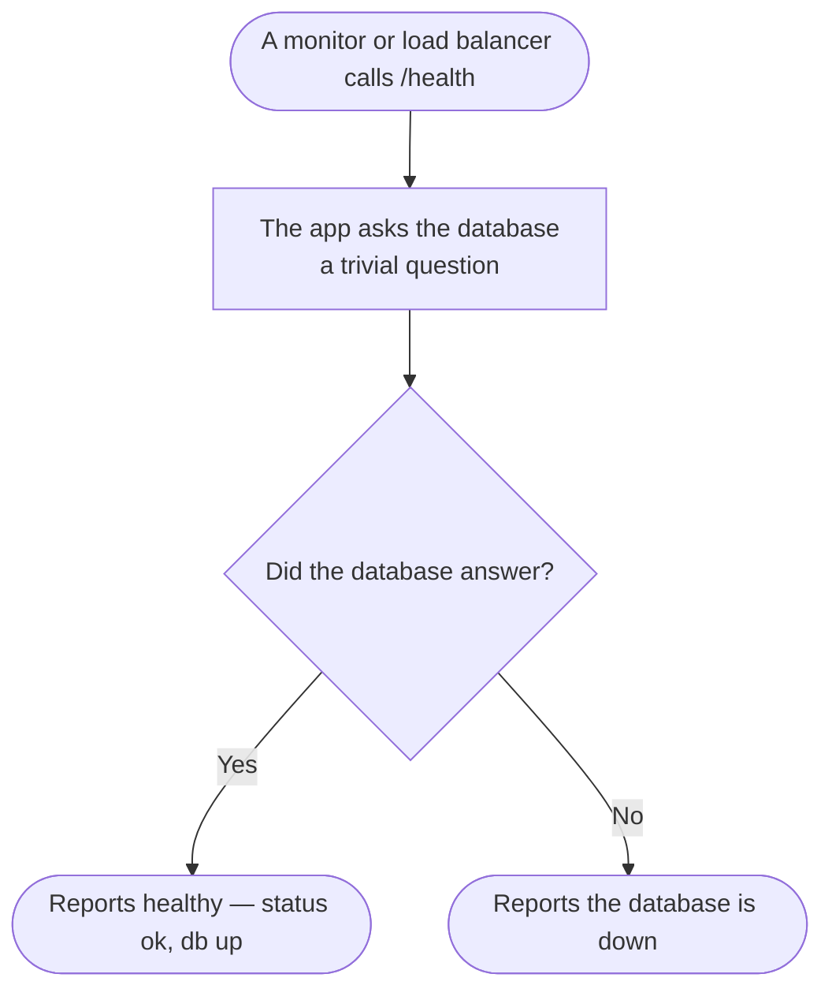

# Health Check

The liveness/readiness probe for the Postgres backend — the first thing stood up
in Phase 0 and the endpoint the production deploy, load balancer, and uptime
checks hit.

## What it does

`GET /api/v1/health` runs a trivial `SELECT 1` against the database and returns:

```json
{ "status": "ok", "db": "up", "ts": "2026-08-25T15:48:17.922Z" }
```

- `status: "ok"` — the app process is serving.
- `db: "up"` — the TypeORM connection to Postgres answered. If the query fails the
  response reports the DB as down (and the check is unhealthy) rather than
  throwing, so a monitor gets a clear signal.

It is **unauthenticated** by design (no JWT) so external probes can reach it, and
it touches no tenant data.

## Endpoints

- `GET /api/v1/health` — public liveness + DB readiness probe.

## Migration status

Nexora-native — nothing to migrate. It exercises the ported
`bootstrap/database` connection (the always-on default TypeORM connection against
Supabase Postgres).

## Rollback

Removing it only removes the probe; it holds no state and has no dependents beyond
external monitors. Deploy tooling (`DEPLOYMENT.md`) and the load balancer expect
it, so keep it mounted in production.

## Flow (happy path)


