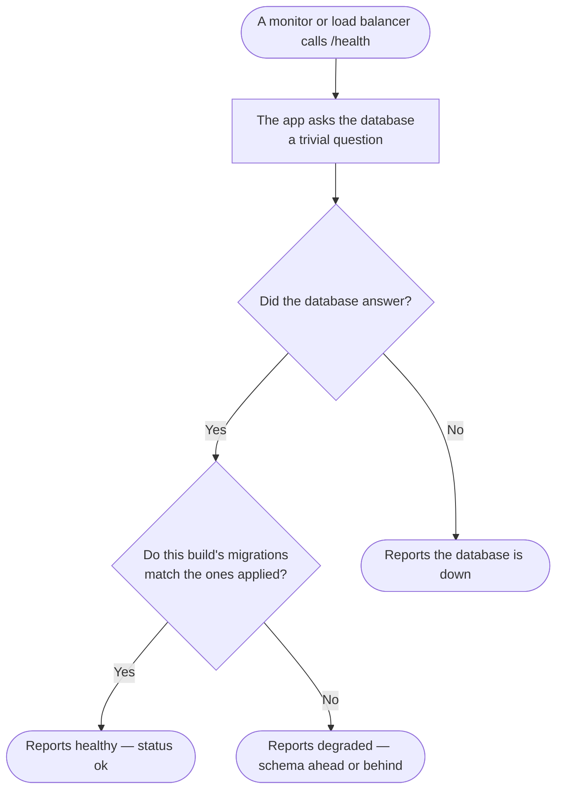

# Health Check

The liveness/readiness probe for the Postgres backend — the first thing stood up
in Phase 0 and the endpoint the production deploy, load balancer, and uptime
checks hit.

## What it does

`GET /api/v1/health` runs a trivial `SELECT 1` against the database, compares this
build's migrations with the ones the database has applied, and returns:

```json
{ "status": "ok", "db": "up", "schema": "match", "version": "d7e6256…", "ts": "2026-08-25T15:48:17.922Z" }
```

- `status` — `"ok"` when the app is serving, the database answered and the schema
  matches; `"degraded"` otherwise. Always HTTP 200: a mismatch needs a human, not
  a restart loop or nginx pulling the box out of rotation.
- `db: "up"` — the TypeORM connection to Postgres answered. If the query fails the
  response reports the DB as down rather than throwing, so a monitor gets a clear
  signal.
- `version` — the commit this container was built from (`APP_GIT_SHA`, set by the
  deploy job; `"unknown"` when it wasn't). The deploy polls this to prove the
  container swap actually took.
- `schema` — `match` / `ahead` (migrations pending) / `behind` (**the database is
  ahead of this build**) / `unknown`. `behind` is the dangerous one: the process
  looks alive but answers every request that touches a changed table with
  `relation "…" does not exist`. That took Client leads and the Clients dashboard
  down on 2026-09-18 after migrations landed and the container swap didn't.

It is **unauthenticated** by design (no JWT) so external probes can reach it, and
it touches no tenant data.

## Endpoints

- `GET /api/v1/health` — public liveness + DB readiness + build/schema agreement.

It exposes a commit sha and a schema comparison, nothing tenant-scoped, and no
detail about *what* differs — enough for a deploy to verify itself, not enough to
map the estate.

## Migration status

Nexora-native — nothing to migrate. It exercises the ported
`bootstrap/database` connection (the always-on default TypeORM connection against
Supabase Postgres).

## Rollback

Removing it only removes the probe; it holds no state and has no dependents beyond
external monitors. Deploy tooling (`DEPLOYMENT.md`) and the load balancer expect
it, so keep it mounted in production.

## Flow (happy path)


