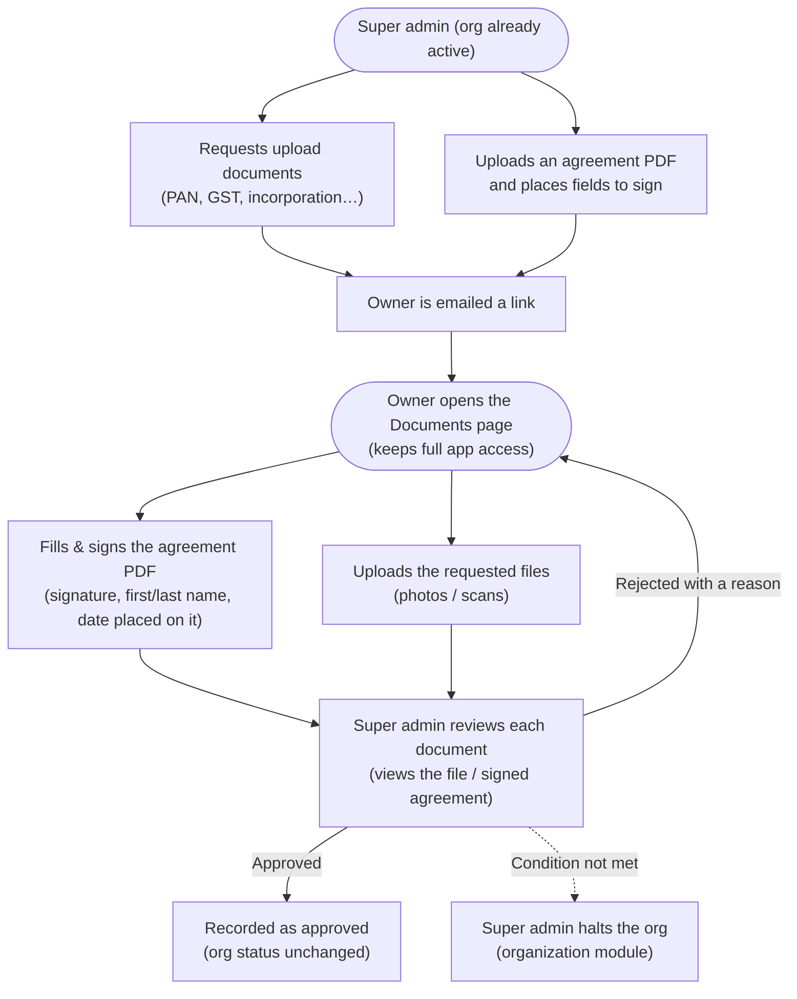

# Organization Onboarding & Document Approval

> **Access is gated by Terms & Conditions consent, not documents.** The consent
> gate + org lifecycle (halt/reactivate) live in the **organization** module —
> see its playbook. This module is the **document compliance** side: requesting,
> submitting, and approving documents, all **non-blocking**.

A platform (super) admin can request documents from an organization at any time.
The owner **sees** the requests and can submit them, but the organization keeps
full access throughout — documents never lock the app. Enforcement, if a required
condition isn't met, is a **manual halt** by the super admin (organization
module). Two kinds of request:

- **Documents to upload** (photos / scans the org provides): picked from a library
  of ready-made requests (PAN card, GST certificate, certificate of incorporation,
  bank details, …). A document already requested can't be requested again.
- **Agreements to sign**: the super admin **uploads the actual PDF** and **places
  the fields** the org must fill on it — signature, first name, last name, date,
  and so on. There are no pre-canned agreement templates.

This is the journey the module guarantees:

1. **Super admin requests what's needed** — upload documents and/or a prepared
   agreement PDF. The owner is emailed a link.
2. **The owner submits each document** — **uploads** the files asked for, and for
   an agreement **fills and signs the placed fields** right on the PDF in the
   browser (draw or type the signature, type the name/date/…). The org stays
   fully usable the whole time.
3. **Super admin reviews each document** — views the uploaded file or the signed
   agreement, then approves it, or rejects it with a reason so the owner can fix
   and re-submit. Approving/rejecting **does not** change the org's status.
4. **If a condition isn't met** — the super admin **halts** the org (organization
   module), which blocks it until reactivated.

## Flow (happy path)

How documents are requested, submitted, and reviewed (non-blocking):

### What each step needs

Plain-English detail on what happens at each step:

| Step | What you provide | Required? |
| --- | --- | --- |
| **Create an organization** | The organization's **name** and the **owner's email** | required |
| | Owner's first / last name | optional |
| **Request upload documents** | Pick one or more from the **library** (e.g. PAN card, Certificate of Incorporation). Already-requested ones are disabled. | — |
| **Prepare an agreement** | Upload the **PDF**, a **title**, and a **category** (pick a suggestion or type your own) | title + PDF |
| | **Place the fields** the owner must fill (signature, first name, last name, name, date, text, email) on the PDF | at least one field |
| | Whether to **email** the owner right away | optional (on by default) |
| **Fill an agreement** (owner) | A **signature** (drawn or typed) in each signature box, and the **name/date/…** values in the placed fields | required fields must be filled |
| **Upload a document** (owner) | The **file** asked for (PDF / image, up to 25 MB) | required for upload documents |
| **Approve / reject** (super admin) | An optional **note** on approve; a **reason** is required on reject | reason required to reject |

Nothing else is needed to onboard an organization — a name and an owner to
start, the documents the super admin asks for, and a signature or file for each.

## The document library (things the org uploads)

The requestable library is **upload documents only** — the photos / scans an org
provides. Built-ins (auto-seeded on startup, shared across all orgs):

| Document | Kind |
| --- | --- |
| Certificate of Incorporation | upload |
| GST / Tax Registration Certificate | upload |
| Company PAN Card | upload |
| Bank Account Details | upload |
| Registered Address Proof | upload |
| Board Resolution | upload |
| Authorized Signatory ID Proof | upload |

A super admin can also add a quick custom upload request. A document already
requested for an org **cannot be requested again** (it's disabled in the picker,
and the backend skips duplicates and reports them as `skipped`).

## Agreements (super admin uploads a PDF and places fields)

Agreements are **not** library templates — the super admin **uploads the actual
agreement PDF** and places the fields the org must fill directly on it. Field
types: **signature, initials, first name, last name, full name, date, text,
email**. Each field is stored page-relative (`xPct/yPct/wPct/hPct` — percentages,
the same convention as the monolith's e-sign, so the box lands in the same spot
whatever the render scale). The uploaded PDF is stored against the org
(`sourceFileId`) so the owner can open it; the owner renders it, fills the placed
fields, draws or types the signature, and submits.

## Signatures (reused from the monolith's e-sign)

The signing contract is ported faithfully from the monolith's `ClientDocument`
e-sign: a submitted signature records the **signer name**, **method** (`drawn` or
`typed`), **timestamp**, **IP**, and **user-agent**, plus the **filled field
values**; the document moves `requested → submitted → approved | rejected`. A
drawn signature is captured on a canvas and stored as an image via the file
service; a typed signature records the name and method. The owner can reuse one
signature across every signature box in the flow, and (best-effort) the filled
PDF is flattened client-side (pdf-lib) and stored as the submitted file.

## Overview & endpoints

All routes are under the global `/api/v1` prefix.

### Platform admin (super-admin only)

| Method | Path | Purpose |
| --- | --- | --- |
| GET / POST / DELETE | `/admin/document-templates` | List, add, or remove upload-document templates. |
| POST | `/admin/organizations/:orgId/upload` | Upload a source PDF for an org (multipart `file`) → file id, used as `sourceFileId`. |
| POST | `/admin/organizations/:orgId/documents` | Request documents: `{templateKeys?, customDocuments?, notify?}`. A `customDocuments[]` entry may carry `sourceFileId` + placed `fields` (an agreement). Already-requested templates are skipped and returned as `skipped`. |
| GET | `/admin/organizations/:orgId/onboarding` | The org's onboarding status + every document + summary. |
| POST | `/admin/onboarding-documents/:id/approve` | Approve a submitted document (`{note?}`). Does **not** change the org's status. |
| POST | `/admin/onboarding-documents/:id/reject` | Reject a submitted document (`{note}` required) — reopens it for re-submission. |

Org lifecycle (halt/reactivate/consent) lives in the **organization** module.

### Org owner (the documents surface)

The acting org is **always** the JWT's `organizationId` — never taken from the
client. This surface is non-blocking; the owner reaches it as a normal in-app page.

| Method | Path | Purpose |
| --- | --- | --- |
| GET | `/onboarding` | The owner's document checklist + status + summary. |
| GET | `/onboarding/documents/:id` | One requested document (agreement PDF `sourceFileId` + placed `fields`, or upload instructions). |
| POST | `/onboarding/documents/:id/submit` | Sign / fill an agreement (`signerName`, `method`, `signatureFileId`, `fieldValues`) and/or attach a file (`submittedFileId`). |

### File storage (any authenticated member)

| Method | Path | Purpose |
| --- | --- | --- |
| POST | `/media/upload` | Upload a file (multipart `file`) → returns a file id. |
| GET | `/media/files/:id/download` | Download a stored file (org-scoped access check). |

### Data model (entities → tables)

- **`onboarding_document_templates`** — the requestable document library (built-in + custom). *New.*
- **`onboarding_document_requests`** — a document requested from one org, with its e-sign state, placed `fields`, `source_file_id` (agreement PDF), and approval. *New.*
- **`document_files`** — stored files (S3 key OR inline `bytea`). *New.*
- **`email_outbox`** — every email produced (dev/CI-verifiable). *New.*
- **`organizations`** — reused; its `status` now also carries `onboarding`.

## Emails

Every document step notifies the org by email, using the monolith's branded HTML
system (grey canvas, white card, brand-blue header, CTA button): **documents
requested** (with a submit link), **document approved**, and **document rejected**
(with the reason). Delivery is driver-based
(`MAIL_DRIVER`): `zeptomail` / `smtp` for real sending, and an **outbox** driver
(default in dev/CI) that persists every email to `email_outbox` so delivery is
verifiable without a mail server. Swapping in real SMTP/ZeptoMail creds is a
pure config change.

## Storage

Files use the monolith's S3 upload mechanics (`<orgId>/<uuid>.<ext>` keys,
private bucket, presigned/proxied download). When `S3_*` creds are set it uses
real S3; otherwise it falls back to storing bytes in Postgres — so dev/CI run
self-contained, and production is one env change away.

## Migration status & steps

- **Status:** ✅ live on Postgres. Full flow verified end to end (request → owner
  sign/upload → approve/reject), all non-blocking, plus the authorization
  negatives. The access gate (consent / halt) is covered by the organization
  playbook.
- **Entities:** new `OnboardingDocumentTemplateEntity`,
  `OnboardingDocumentRequestEntity`, `DocumentFileEntity`, `EmailOutboxEntity`;
  reused `OrganizationEntity`, `UserEntity`.
- **Migrations:** `OnboardingDocuments` (creates the four tables above) +
  `OnboardingSourceFile` (adds `onboarding_document_requests.source_file_id`).
- **Run migrations:** `npm run migration:run`

## Rollback

Additive and reversible — the monolith is untouched.

1. `npm run migration:revert` drops the four new tables. `organizations` rows are
   unchanged apart from any that hold the `onboarding` status value.
2. Remove `OnboardingModule` (and, if desired, `MailModule` / `StorageModule`)
   from `app.module.ts` to unmount the routes.
3. Revert `organization.service` to provision orgs as `active`, and remove the
   org-status checks in `AuthService.resolveOrgRoute` / `OrgAdminGuard` to drop
   the gate.

## Authorization

- **`/admin/*`** — JWT + platform-admin (super admin) only.
- **`/onboarding/*`** — JWT + org owner/admin (non-blocking documents surface).
- The app-access gate (`/org/*` requires the org to be **not suspended** and to
  have **accepted the current Terms**) lives in the organization module.
- Org scope is always taken from the token, never the request body/params.

## Deferred (not in this phase)

Server-side (authoritative) PDF flattening — the filled PDF is flattened
client-side (pdf-lib, best-effort) today; the signature image, field values, and
signer identity are the source of truth. Also: a daily "documents still pending"
reminder cron (the monolith's pattern), per-document re-request/versioning, and
multi-signer documents. These can follow the monolith's e-sign playbook.

## Scenarios & tests

Gherkin scenarios live in `src/modules/onboarding/features/*.feature`, bound to
supertest integration specs (`*.e2e-spec.ts`, jest-cucumber) plus pure unit
specs (guards, email templates, routing gate). Live pass/fail + coverage from the
latest CI run are merged into this playbook by the `admin-playbooks` API.

---

# Part 2 — Employee Onboarding Lifecycle

> Distinct from the org document-approval flow above. This is the **HR
> onboarding of a new hire**: their documents, checklist, probation and progress.
> In Nexora **the person IS the `OrgMembership`** — there is no separate HR
> Employee entity — so a lifecycle record attaches to a membership.

## What it does

An org configures **what a hire must submit/complete** once (the onboarding
**policy config**). HR then **initiates** onboarding for a member — a record is
seeded from that config with a document checklist, a task checklist, a probation
window and a target date. The hire **self-serves** on *My Onboarding* (uploads
documents, ticks welcome tasks); HR **verifies/rejects** documents and
**completes** the onboarding. A policy edit **reconciles onto** in-progress
onboardings on the next read (never discarding already-submitted work).

## Requirements are policy-driven

The requirements live on the org's `onboarding` **policy** (a singleton row,
`category: onboarding`, `applicableTo: all`) carrying an `onboardingConfig` in
`extra_config`. When none is saved, catalog defaults apply (so an org that never
opens Settings still onboards sensibly). Catalog + defaults:
`src/modules/policy/onboarding-catalog.ts`.

- `GET  /policies/onboarding-catalog` — the grouped document catalog + defaults (policies:view)
- `GET  /policies/onboarding-config` — the org's live requirements (policies:view)
- `PUT  /policies/onboarding-config` — save the requirements (policies:edit)

## Endpoints

### HR / admin / owner (`onboarding:manage` or an owner/admin/HR tier)
- `POST /onboarding/lifecycle/initiate` — start onboarding for a member (by membership id **or** userId)
- `GET  /onboarding/lifecycle` — all onboardings (reconciled-on-read)
- `GET  /onboarding/lifecycle/active-membership-ids` — membershipIds already onboarding/onboarded (the initiate-picker filter)
- `GET  /onboarding/lifecycle/:id` — one record
- `POST /onboarding/lifecycle/:id/documents/:key/verify` — verify an uploaded document
- `POST /onboarding/lifecycle/:id/documents/:key/reject` — reject with a note (re-opens the slot)
- `POST /onboarding/lifecycle/:id/complete` — mark completed
- `POST /onboarding/lifecycle/:id/cancel` — cancel (supersedable on re-initiate)

Gated by `OnboardingAccessGuard` (owner/admin/HR tiers, or a permScoped
`onboarding:manage` role; org-lifecycle gate as elsewhere).

### Employee self-service (any authenticated member)
- `GET  /onboarding/me` — my active onboarding, or `null`
- `POST /onboarding/me/documents/:key/upload` — attach an uploaded file id to a slot
- `POST /onboarding/me/checklist/:key/complete` — tick a self-serviceable task (403 on HR/IT-owned tasks)

Document bytes flow through the generic `POST /media/upload` → `fileId`, recorded
against the slot.

## Data model

- `member_onboardings` — one record per onboarded membership. `documents[]` and
  `checklist[]` are jsonb slot arrays; `status` = pending → in_progress →
  completed | cancelled; probation/target dates denormalized. Entity:
  `entities/member-onboarding.entity.ts`.

## Lifecycle rules

- **Initiate** seeds docs+checklist from the policy config, computes
  `probationEndDate` (start + months) and `targetDate` (start + targetDays),
  emails the hire a welcome, and **supersedes** any prior *cancelled* record. A
  member with a pending/in_progress/completed onboarding can't be re-initiated.
- **Reconcile-on-read** (list / get / my) syncs a record's documents to the live
  policy: adds newly-required docs (pending), drops policy-removed docs **only if
  still pending**, refreshes title/required, orders to the policy. Completed /
  cancelled records are skipped (historical).
- **Self-complete guard**: a hire may only complete tasks assigned to them or in
  a self-serviceable category (documents/welcome/training) — never IT/compliance.
- **Daily reminder**: `@Cron('0 10 * * *')` emails hires with outstanding items
  (email-only — Nexora has no in-app notification module yet).

## Migration

- **Entity:** `MemberOnboardingEntity` → `member_onboardings`.
- **Migration:** `MemberOnboarding1787840000000` (creates the table + indexes).
  Registered in `test/global-setup.ts` (the hardcoded entity + migration lists).

## Rollback

Drop the `MemberOnboarding` migration (drops `member_onboardings`) and remove the
`MemberOnboardingController` / `MyOnboardingController` from the module. The
policy `onboardingConfig` is inert config on an existing table — safe to leave.

## Scenarios & tests

`features/onboarding-config.feature`, `onboarding-lifecycle.feature`,
`onboarding-self-service.feature` (jest-cucumber e2e). The lifecycle covers
initiate, duplicate-block, verify, reject, reconcile-on-read, complete, and the
employee/HR authorization split; self-service covers read, upload, self-complete,
the IT-task block, and the no-onboarding empty result.
