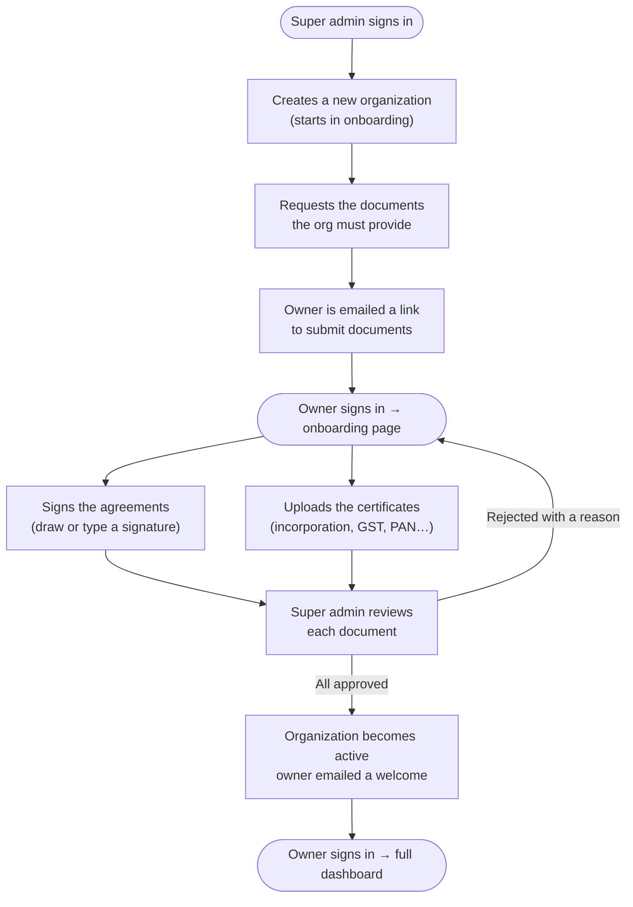

# Organization Onboarding & Document Approval

Before a brand-new organization can use Nugenova, it must be **verified**. A
platform (super) admin provisions the org, asks it for the documents needed to
onboard, and reviews what comes back. The organization can sign in only to submit
those documents — the rest of the app stays locked until **every** document is
approved, at which point the organization goes live.

This is the journey the module guarantees:

1. **Super admin creates the organization** — names it and nominates an owner by
   email. The org is created in the **onboarding** state (not yet active).
2. **Super admin requests documents** — picks from a library of ready-made
   document templates (NDA, service agreement, certificate of incorporation, GST
   certificate, and more) and/or adds custom ones. The owner is emailed a link.
3. **The owner signs in** — and lands on a dedicated **onboarding** page. They
   cannot reach departments, roles, team, or anything else yet.
4. **The owner submits each document** — signs the agreements in the browser
   (draw or type a signature) and uploads the certificates asked for.
5. **Super admin reviews each document** — approves it, or rejects it with a
   reason so the owner can fix and re-submit.
6. **The organization goes live** — the moment the last document is approved the
   org flips to **active**, the owner is emailed a welcome, and on their next
   sign-in they land on the full dashboard.

## Flow (happy path)

How a brand-new organization gets verified and activated, start to finish:

### What each step needs

Plain-English detail on what happens at each step:

| Step | What you provide | Required? |
| --- | --- | --- |
| **Create an organization** | The organization's **name** and the **owner's email** | required |
| | Owner's first / last name | optional |
| **Request documents** | Pick one or more **templates** from the library (e.g. NDA, Certificate of Incorporation) | at least one document |
| | Optionally add a **custom document** (a title + whether it needs a signature or a file) | optional |
| | Whether to **email** the owner right away | optional (on by default) |
| **Sign a document** (owner) | Your **full name** as the signer | required |
| | A **signature** — drawn with the mouse/finger or typed | required for signature documents |
| **Upload a document** (owner) | The **file** asked for (PDF / image, up to 25 MB) | required for upload documents |
| **Approve / reject** (super admin) | An optional **note** on approve; a **reason** is required on reject | reason required to reject |

Nothing else is needed to onboard an organization — a name and an owner to
start, the documents the super admin asks for, and a signature or file for each.

## The document library

The super admin requests documents from a seeded, reusable library. Built-ins
(auto-seeded on startup, shared across all orgs):

| Template | Kind |
| --- | --- |
| Mutual Non-Disclosure Agreement | sign |
| Master Services Agreement | sign |
| Data Processing Agreement | sign |
| Authorized Signatory Declaration | sign |
| Certificate of Incorporation | upload |
| GST / Tax Registration Certificate | upload |
| Company PAN Card | upload |
| Bank Account Details | upload |

Super admins can add their own custom templates too. Signature documents carry a
signature-field layout (percentage-positioned boxes, the same convention as the
monolith's e-sign) and their agreement text.

## Signatures (reused from the monolith's e-sign)

The signing contract is ported faithfully from the monolith's `ClientDocument`
e-sign: a submitted signature records the **signer name**, **method** (`drawn` or
`typed`), **timestamp**, **IP**, and **user-agent**, and the document moves
`requested → submitted → approved | rejected`. A drawn signature is captured in
the browser and stored as an image via the file service; a typed signature
records the name and method. The owner can reuse one signature across every
agreement in the flow.

## Overview & endpoints

All routes are under the global `/api/v1` prefix.

### Platform admin (super-admin only)

| Method | Path | Purpose |
| --- | --- | --- |
| GET / POST / DELETE | `/admin/document-templates` | List, add, or remove document templates. |
| POST | `/admin/organizations/:orgId/documents` | Request documents from an org: `{templateKeys?, customDocuments?, notify?}`. |
| GET | `/admin/organizations/:orgId/onboarding` | The org's onboarding status + every document + summary. |
| POST | `/admin/onboarding-documents/:id/approve` | Approve a submitted document (`{note?}`). Activates the org when it's the last one. |
| POST | `/admin/onboarding-documents/:id/reject` | Reject a submitted document (`{note}` required) — reopens it for re-submission. |
| POST | `/admin/organizations/:orgId/activate` | Manually activate (all approved), or `?force=true` to override. |

### Org owner (the onboarding surface)

The acting org is **always** the JWT's `organizationId` — never taken from the
client. Reachable while the org is in `onboarding`; unlike the rest of `/org/*`
it does **not** require the org to be active.

| Method | Path | Purpose |
| --- | --- | --- |
| GET | `/onboarding` | The owner's document checklist + status + summary. |
| GET | `/onboarding/documents/:id` | One requested document (with its agreement text). |
| POST | `/onboarding/documents/:id/submit` | Sign and/or attach a file for a document. |

### File storage (any authenticated member)

| Method | Path | Purpose |
| --- | --- | --- |
| POST | `/media/upload` | Upload a file (multipart `file`) → returns a file id. |
| GET | `/media/files/:id/download` | Download a stored file (org-scoped access check). |

### Data model (entities → tables)

- **`onboarding_document_templates`** — the requestable document library (built-in + custom). *New.*
- **`onboarding_document_requests`** — a document requested from one org, with its e-sign state + approval. *New.*
- **`document_files`** — stored files (S3 key OR inline `bytea`). *New.*
- **`email_outbox`** — every email produced (dev/CI-verifiable). *New.*
- **`organizations`** — reused; its `status` now also carries `onboarding`.

## Emails

Every step notifies the org by email, using the monolith's branded HTML system
(grey canvas, white card, brand-blue header, CTA button): **documents requested**
(with a submit link), **document approved**, **document rejected** (with the
reason), and an **organization activated** welcome. Delivery is driver-based
(`MAIL_DRIVER`): `zeptomail` / `smtp` for real sending, and an **outbox** driver
(default in dev/CI) that persists every email to `email_outbox` so delivery is
verifiable without a mail server. Swapping in real SMTP/ZeptoMail creds is a
pure config change.

## Storage

Files use the monolith's S3 upload mechanics (`<orgId>/<uuid>.<ext>` keys,
private bucket, presigned/proxied download). When `S3_*` creds are set it uses
real S3; otherwise it falls back to storing bytes in Postgres — so dev/CI run
self-contained, and production is one env change away.

## Migration status & steps

- **Status:** ✅ live on Postgres. Full flow verified end to end (provision →
  request → owner sign/upload → approve → activate → dashboard), plus the login
  gate and the authorization negatives.
- **Entities:** new `OnboardingDocumentTemplateEntity`,
  `OnboardingDocumentRequestEntity`, `DocumentFileEntity`, `EmailOutboxEntity`;
  reused `OrganizationEntity`, `UserEntity`.
- **Migration:** `OnboardingDocuments` — creates the four tables above.
- **Run migrations:** `npm run migration:run`

## Rollback

Additive and reversible — the monolith is untouched.

1. `npm run migration:revert` drops the four new tables. `organizations` rows are
   unchanged apart from any that hold the `onboarding` status value.
2. Remove `OnboardingModule` (and, if desired, `MailModule` / `StorageModule`)
   from `app.module.ts` to unmount the routes.
3. Revert `organization.service` to provision orgs as `active`, and remove the
   org-status checks in `AuthService.resolveOrgRoute` / `OrgAdminGuard` to drop
   the gate.

## Authorization

- **`/admin/*`** — JWT + platform-admin (super admin) only.
- **`/onboarding/*`** — JWT + org owner/admin; reachable during onboarding.
- **`/org/*`** — JWT + org-admin **and the org must be `active`** — an onboarding
  org's owner is 403 here until activation.
- Org scope is always taken from the token, never the request body/params.

## Deferred (not in this phase)

Server-side flattening of the drawn signature into a signed PDF (the monolith
did this client-side; here the signature image + metadata are stored), a daily
"documents still pending" reminder cron (the monolith's pattern), per-document
re-request/versioning, and multi-signer documents. These can follow the
monolith's e-sign playbook.

## Scenarios & tests

Gherkin scenarios live in `src/modules/onboarding/features/*.feature`, bound to
supertest integration specs (`*.e2e-spec.ts`, jest-cucumber) plus pure unit
specs (guards, email templates, routing gate). Live pass/fail + coverage from the
latest CI run are merged into this playbook by the `admin-playbooks` API.
