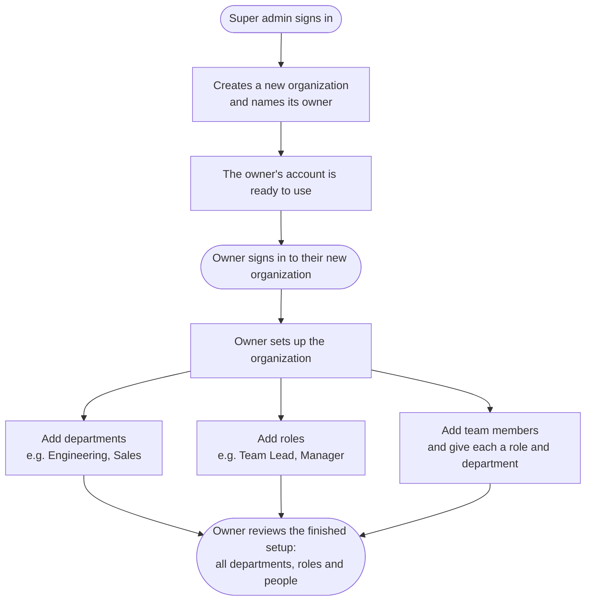

# Organization Onboarding

The tenant setup spine. A platform (super) admin provisions an organization and
nominates its owner; the owner then logs in and sets up **departments**,
**roles**, and **team members** — enough to stand a new org up end to end.

This is the journey the module guarantees:

1. **Super admin logs in** — passwordless email-OTP (see the `auth` playbook).
2. **Super admin creates an org** — names it and nominates an owner by email.
   The org, the owner user, and the owner's active membership are created; the
   owner is pointed at the new org.
3. **The owner logs in** — email-OTP — and lands on `/dashboard` scoped to the
   new org (`orgRole: owner`).
4. **The owner sets up the org** — creates departments, custom roles, and adds
   team members (optionally assigning each a role + department).
5. **The owner reviews the org** — lists back the departments, roles, and people
   they created via a single overview.

## Flow (happy path)

How a brand-new organization gets set up, start to finish:

### What each step needs

Plain-English detail on what you fill in at each step:

| Step | What you provide | Required? |
| --- | --- | --- |
| **Create an organization** | The organization's **name** (e.g. "Acme Corp") | required |
| | The **owner's email** (who will run it) | required |
| | Owner's first / last name | optional |
| **Add a department** | A **name** (e.g. "Engineering", "Sales") — must be unique in the org | required |
| | A short **description** | optional |
| | A **department head** and a **parent department** | optional |
| **Add a role** | A **name** (e.g. "Team Lead") — must be unique in the org | required |
| | A **display name** and **description** | optional |
| | **What it can do** (permissions, e.g. "can view & edit projects") | optional |
| | Which **department** it belongs to | optional |
| **Add a team member** | Their **email** | required |
| | Their **role** (owner / admin / manager / employee, or a custom role) | optional — defaults to *employee* |
| | Which **department** they're in | optional |
| | Their **first / last name** | optional |

Nothing else is needed to stand a new organization up — a name and an owner to
start, then a name for each department and role, and an email for each person.

## Overview & endpoints

All routes are under the global `/api/v1` prefix.

### Platform admin (super-admin only)

| Method | Path | Purpose |
| --- | --- | --- |
| POST | `/admin/organizations` | Provision an org: `{name, ownerEmail, ownerFirstName?, ownerLastName?}` → org + owner + owner membership. |
| GET | `/admin/organizations` | List all organizations. |
| GET | `/admin/organizations/:id` | Fetch one organization. |

### Org admin (owner/admin of the JWT's org)

The acting org is **always** the JWT's `organizationId` — routes never take an
org id from the client, so a token for org A can't touch org B.

| Method | Path | Purpose |
| --- | --- | --- |
| POST / GET | `/org/departments` | Create / list departments. |
| PUT / DELETE | `/org/departments/:id` | Update / soft-delete a department. |
| POST / GET | `/org/roles` | Create / list custom roles (with a permission matrix). |
| PUT / DELETE | `/org/roles/:id` | Update / soft-delete a role. |
| POST / GET | `/org/members` | Add / list team members (with role + department). |
| GET | `/org/overview` | Counts + full lists of departments, roles, and people. |

### Data model (entities → tables)

- **`organizations`** — the tenant (name, unique slug, status, ownerId, createdBy). *New this migration.*
- **`departments`** — org-scoped grouping (name unique per org, optional head + parent). *New this migration.*
- **`roles`** — reused from `auth`; org-scoped custom roles with a jsonb permission matrix.
- **`org_memberships`** — reused from `auth`; the people of an org (+ a new `department_id` link added this migration).
- **`users`** — reused from `auth`; owner/members resolve to (or are created as) users.

## Migration status & steps

- **Status:** ✅ live on Postgres. Full flow verified end to end (super admin →
  create org → owner login → departments/roles/members → overview), plus the
  two authorization negatives (member can't admin, non-super-admin can't
  provision).
- **Entities:** new `OrganizationEntity`, `DepartmentEntity`; reused `RoleEntity`,
  `OrgMembershipEntity`, `UserEntity` from `auth`.
- **Migration:** `OrganizationDepartments` — creates `organizations` +
  `departments` and adds `org_memberships.department_id`.
- **Run migrations:** `npm run migration:run`

## Rollback

Additive and reversible — the monolith is untouched.

1. `npm run migration:revert` drops `organizations`, `departments`, and the
   `org_memberships.department_id` column. `users` / `org_memberships` rows are
   otherwise unchanged.
2. Remove `OrganizationModule` from `app.module.ts` to unmount the routes.

## Authorization

- **`/admin/organizations/*`** — JWT + platform-admin (super admin) only.
- **`/org/*`** — JWT + org-admin: the session's `orgRole` must be `owner` or
  `admin` (platform admins also pass). A member on the `employee` tier is 403.
- Org scope is taken from the token, never the request body/params.

## Deferred (not in this phase)

Email invitations for added members (they're created active, no invite mail yet),
department hierarchy editing beyond a single parent link, role assignment UI,
org suspension/deletion lifecycle, and per-endpoint field-level permission
enforcement. These land with later people/HR modules.

## Scenarios & tests

Gherkin scenarios live in `src/modules/organization/features/*.feature`, bound to
supertest integration specs (`*.e2e-spec.ts`, jest-cucumber) plus pure unit
specs. Live pass/fail + coverage from the latest CI run are merged into this
playbook by the `admin-playbooks` API.
