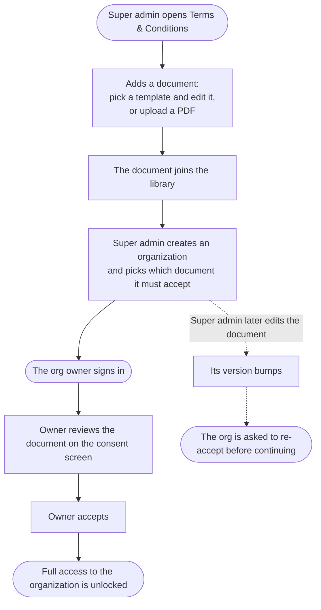

# Terms & Conditions Library

The **platform T&C library** — a catalog of named Terms & Conditions documents
the super admin maintains and assigns to organizations. It is the data + rules
behind the **consent gate** enforced by the `organization` module (see that
playbook for the org-facing consent flow).

Each document is one of two kinds:

- **`html`** — authored from a **ready-made template** (Standard SaaS, Startup,
  Enterprise, Privacy / Data-Processing) and then edited. The org reads the
  rendered HTML on its consent screen.
- **`pdf`** — an **uploaded PDF**, stored via the shared `StorageService` (S3 with
  a Postgres-`bytea` fallback). The org reads the embedded PDF and accepts it
  as-is.

**Versioning drives re-consent.** Every document carries its own `version`
(starts at 1). Editing a document **bumps its version**, and every org assigned
that document must **re-accept** — a stale org is routed back to `/consent` and
blocked from `/org/*` until it does. A small in-memory `{ id → version }` cache
keeps the `needsConsent` check off the hot path (guards + login routing) without
a DB round-trip; it's refreshed on every mutation.

**No auto-seed.** The library starts empty; the super admin adds documents.
Creating an org **requires** picking a `termsId` (the UI prompts to add one first
if the library is empty). **Deleting** a document is **blocked (409) while any org
is assigned it** — reassign first.

## Endpoints

The `TermsService` (this module) owns the model + rules; the HTTP surface is
mounted by the `organization` module:

- `GET  /admin/terms` — list the library (super admin).
- `GET  /admin/terms/templates` — the ready-made HTML starting points.
- `POST /admin/terms` — create an HTML document; `POST /admin/terms/pdf` — upload a PDF.
- `GET/PUT/DELETE /admin/terms/:id` — read / edit (version bump) / delete (blocked if in use).
- `GET  /admin/terms/:id/document` — stream a PDF document's bytes.
- Consent side (org owner): `GET /consent`, `POST /consent/accept`, `GET /consent/document`.

Core service API: `list` · `get` · `exists` · `create` · `update` (bumps version)
· `remove` · `getVersion` (cache) · **`needsConsent(termsId, consent)`** ·
`getForConsent` · `getDocumentBytes` · `listTemplates`.

## Migration status

- **Migrated** Mongo → Postgres. Entity `PlatformTermsEntity` (`platform_terms`):
  `title`, per-doc `version`, `kind` (html|pdf), `text` (nullable), `fileId`
  (varchar 24 → `document_files`), `updatedBy`.
- Migrations: `TermsSourceKind` (kind/title/file_id, text nullable),
  `TermsLibrary` (drop the global version-unique constraint, add `terms_id` on
  organizations). PDF bytes live in the shared `document_files` table under the
  synthetic platform org id.

## Rollback

Disabling the library is a config concern of the consuming module: with no
`termsId` assigned, `needsConsent` returns `false` and the consent gate is a
no-op — orgs are never locked out. To retire the module, drop the T&C selection
from org creation and stop mounting `/admin/terms` + `/consent`; the
`platform_terms` rows can remain untouched.

## Flow (happy path)

How a Terms & Conditions document goes from the library to an accepted consent:

### What each step needs

| Step | What it needs |
|------|----------------|
| Add an HTML document | a name (required) and the terms text (at least a few sentences) |
| Add a PDF document | a name (required) and the uploaded PDF file |
| Assign to an org | pick one document from the library when creating the org (required) |
| Accept | the org owner reviews and accepts on the consent screen |
| Edit | any change bumps the version and asks assigned orgs to re-accept |
| Delete | only allowed when no organization is currently assigned it |
